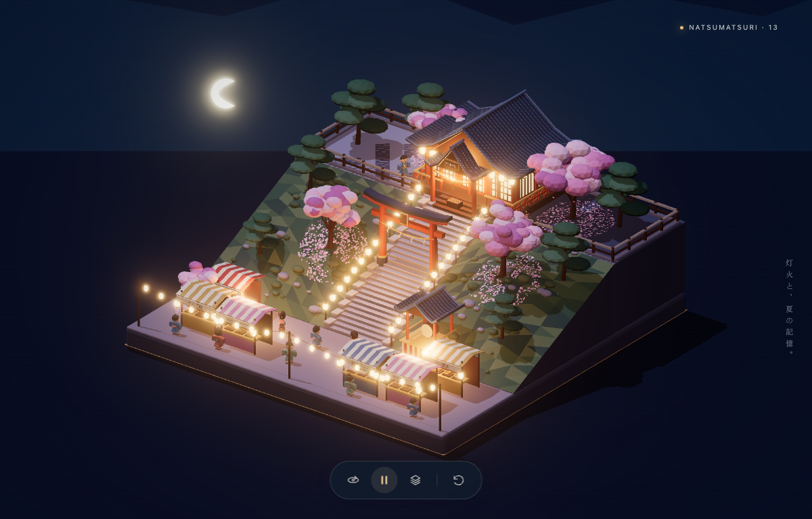

# Astra-arts

日式动漫 low-poly 夏夜微缩场景。当前网页同步 Blender **第 13 版整体模型**，使用 Three.js 加载原生工程导出的 GLB。

[打开静态页面](https://sxy-kumako.github.io/Astra-arts/)

支持拖拽旋转、滚轮缩放和触控操作；包含暖色灯笼、烟花、流星、行走人物与樱花飘落。工具栏可暂停场景动态、自动环绕、分层查看和复位视角。当前包含封闭坡地、平台栏界、前景灯笼线及 11 位人物，其中 3 位巡游、8 位静态占位。

进入页面默认播放动画，不受系统“减少动态效果”设置影响。动画按钮在播放时显示 ⏸（点击暂停），暂停时显示 ▶（点击播放）。

人物与场景效果共用一个 20 秒循环。GLB 导出时按集合和材质合批静态几何，保留动画层级；模型与脚本均由本站提供，不依赖运行时 CDN。网页灯光由 WebGL 重建，与 Blender 渲染存在差异。

GitHub Pages 从 `main` 分支根目录发布。`index.html` 加载 `assets/` 下的脚本和模型，需要通过 HTTP 访问。

```sh
npm ci
npm run build
npm run verify:model
npm test
npm run serve
```

打开 `http://127.0.0.1:18763`。`web/` 为查看器源文件；`scripts/build-web.mjs` 生成可直接发布的页面和脚本。

本地原生工程和阶段备份保留在 `blender/`。更新模型时使用 Blender 5.2.1 LTS 执行 `npm run export:model`，从 `blender/phase-13.blend` 导出 `assets/summer-festival-phase13.glb`，再构建、验证和发布。导出过程不保存或覆盖 `.blend` 工程。

导出时将上层平台底座止于铺面底部，避免重叠表面的深度冲突。加载进度按构建时记录的解压后模型大小计算，不依赖压缩响应的 `Content-Length`；首帧渲染前最多显示 99%。

压缩加载回归：运行 `python3 tests/serve-gzip.py`，在 Playwright CLI 打开 `http://127.0.0.1:19773`，再执行 `run-code --filename=tests/loading-browser.js`。



根目录 `preview.png` 保留为原始构图参考。
